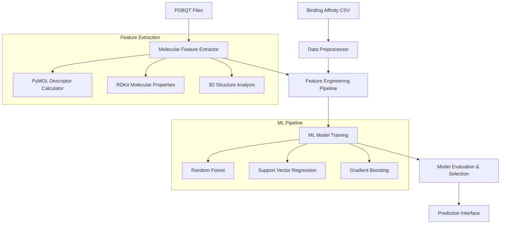

# Design Document

## Overview

The TLR4 Binding Affinity Prediction System is a machine learning pipeline that predicts binding free energies of small molecules to the TLR4 receptor. The system integrates molecular structure analysis, feature extraction, and predictive modeling to accelerate drug discovery for inflammatory and autoimmune disorders.

The pipeline processes PDBQT molecular structure files and AutoDock Vina binding results to create a comprehensive dataset of molecular descriptors and binding affinities. Multiple machine learning algorithms are trained and evaluated to identify the optimal approach for binding prediction.

## Architecture

The system follows a modular pipeline architecture with five main components:



### Component Responsibilities

1. **Molecular Feature Extractor**: Processes PDBQT files to extract 2D/3D molecular descriptors
2. **Data Preprocessor**: Cleans and integrates binding affinity data with molecular features
3. **Feature Engineering Pipeline**: Handles feature scaling, selection, and transformation
4. **ML Model Training**: Trains multiple algorithms with hyperparameter optimization
5. **Prediction Interface**: Provides API for predicting new compound affinities

## Components and Interfaces

### 1. Molecular Feature Extractor

**Purpose**: Extract comprehensive molecular descriptors from PDBQT structure files

**Key Classes**:
- `PDBQTParser`: Reads and validates PDBQT file format
- `MolecularDescriptorCalculator`: Computes 2D molecular properties
- `StructuralFeatureExtractor`: Calculates 3D geometric features using PyMOL

**Interface**:
```python
class MolecularFeatureExtractor:
    def extract_features(self, pdbqt_path: str) -> Dict[str, float]:
        """Extract all molecular features from PDBQT file"""
        
    def batch_extract(self, pdbqt_directory: str) -> pd.DataFrame:
        """Process all PDBQT files in directory"""
```

**Features Extracted**:
- **2D Descriptors**: Molecular weight, LogP, TPSA, rotatable bonds, H-bond donors/acceptors
- **3D Descriptors**: Radius of gyration, molecular volume, surface area, asphericity
- **Topological**: Ring count, aromatic rings, branching index
- **Electronic**: Partial charges, dipole moment, HOMO-LUMO gap

### 2. Data Preprocessor

**Purpose**: Clean, validate, and integrate binding affinity data with molecular features

**Key Classes**:
- `BindingDataLoader`: Reads and validates CSV binding data
- `CompoundMatcher`: Matches compound names between datasets
- `DataIntegrator`: Combines molecular features with binding affinities

**Interface**:
```python
class DataPreprocessor:
    def load_binding_data(self, csv_path: str) -> pd.DataFrame:
        """Load and validate binding affinity data"""
        
    def get_best_affinities(self, binding_df: pd.DataFrame) -> pd.DataFrame:
        """Extract best binding mode for each compound"""
        
    def integrate_datasets(self, features_df: pd.DataFrame, 
                          binding_df: pd.DataFrame) -> pd.DataFrame:
        """Combine molecular features with binding data"""
```

**Data Processing Steps**:
1. Load binding affinity CSV and validate data types
2. Filter for best binding mode (lowest affinity) per compound
3. Handle outliers and missing values
4. Match compound names using fuzzy string matching
5. Create unified dataset with features and targets

### 3. Feature Engineering Pipeline

**Purpose**: Prepare molecular features for machine learning model training

**Key Classes**:
- `FeatureScaler`: Standardizes numerical features
- `FeatureSelector`: Identifies most informative descriptors
- `FeatureTransformer`: Applies mathematical transformations

**Interface**:
```python
class FeatureEngineeringPipeline:
    def fit_transform(self, X: pd.DataFrame, y: pd.Series) -> pd.DataFrame:
        """Fit pipeline and transform features"""
        
    def transform(self, X: pd.DataFrame) -> pd.DataFrame:
        """Transform new data using fitted pipeline"""
```

**Processing Steps**:
1. Remove highly correlated features (correlation > 0.95)
2. Apply standard scaling to numerical features
3. Select top features using mutual information
4. Create polynomial features for key descriptors
5. Handle missing values with median imputation

### 4. ML Model Training

**Purpose**: Train and optimize multiple machine learning algorithms for binding prediction

**Key Classes**:
- `ModelTrainer`: Coordinates training of multiple algorithms
- `HyperparameterOptimizer`: Performs grid search with cross-validation
- `ModelEvaluator`: Calculates performance metrics

**Interface**:
```python
class MLModelTrainer:
    def train_models(self, X_train: pd.DataFrame, y_train: pd.Series) -> Dict[str, Any]:
        """Train all model types with hyperparameter optimization"""
        
    def evaluate_models(self, models: Dict, X_test: pd.DataFrame, 
                       y_test: pd.Series) -> Dict[str, Dict]:
        """Evaluate all models on test set"""
```

**Model Algorithms**:
- **Random Forest**: Ensemble method robust to overfitting
- **Support Vector Regression**: Effective for high-dimensional data
- **Gradient Boosting**: Sequential learning for complex patterns
- **Neural Network**: Deep learning for non-linear relationships

**Hyperparameter Optimization**:
- 5-fold cross-validation for model selection
- Grid search over predefined parameter spaces
- Early stopping for neural networks
- Feature importance analysis for tree-based models

### 5. Prediction Interface

**Purpose**: Provide user-friendly interface for predicting binding affinities of new compounds

**Key Classes**:
- `BindingPredictor`: Main prediction interface
- `UncertaintyEstimator`: Calculates prediction confidence intervals
- `ResultsExporter`: Formats and saves prediction results

**Interface**:
```python
class BindingPredictor:
    def predict_single(self, pdbqt_path: str) -> Dict[str, float]:
        """Predict binding affinity for single compound"""
        
    def predict_batch(self, pdbqt_directory: str) -> pd.DataFrame:
        """Predict affinities for multiple compounds"""
        
    def get_feature_importance(self) -> pd.DataFrame:
        """Return feature importance from best model"""
```

## Data Models

### Molecular Feature Schema
```python
@dataclass
class MolecularFeatures:
    compound_name: str
    molecular_weight: float
    logp: float
    tpsa: float
    rotatable_bonds: int
    hbd: int  # H-bond donors
    hba: int  # H-bond acceptors
    radius_of_gyration: float
    molecular_volume: float
    surface_area: float
    asphericity: float
    ring_count: int
    aromatic_rings: int
    formal_charge: int
```

### Binding Data Schema
```python
@dataclass
class BindingData:
    ligand: str
    mode: int
    affinity: float  # kcal/mol
    rmsd_lb: float
    rmsd_ub: float
```

### Prediction Result Schema
```python
@dataclass
class PredictionResult:
    compound_name: str
    predicted_affinity: float
    confidence_interval_lower: float
    confidence_interval_upper: float
    model_used: str
    feature_contributions: Dict[str, float]
```

## Error Handling

### File Processing Errors
- **Invalid PDBQT Format**: Log error and skip file, continue processing
- **Missing Files**: Raise informative exception with file path
- **Corrupted Data**: Attempt recovery, fallback to default values

### Data Quality Issues
- **Missing Binding Data**: Use median imputation for numerical features
- **Outlier Detection**: Use IQR method, cap extreme values at 99th percentile
- **Feature Correlation**: Remove highly correlated features automatically

### Model Training Errors
- **Convergence Issues**: Increase max iterations, try different solvers
- **Memory Limitations**: Implement batch processing for large datasets
- **Poor Performance**: Provide diagnostic plots and feature importance

### Prediction Errors
- **New Compound Processing**: Validate input format, extract available features
- **Model Loading**: Implement fallback to simpler model if primary fails
- **Feature Mismatch**: Handle missing features with learned defaults

## Testing Strategy

### Unit Testing
- **Feature Extraction**: Test individual descriptor calculations
- **Data Processing**: Validate data cleaning and integration steps
- **Model Training**: Test each algorithm with synthetic data
- **Prediction**: Verify output format and error handling

### Integration Testing
- **End-to-End Pipeline**: Process sample dataset through full workflow
- **Cross-Validation**: Ensure consistent results across data splits
- **Model Persistence**: Test saving and loading trained models

### Performance Testing
- **Scalability**: Test with varying dataset sizes (10-1000 compounds)
- **Memory Usage**: Monitor resource consumption during processing
- **Prediction Speed**: Benchmark inference time for single/batch predictions

### Validation Testing
- **Cross-Validation**: 5-fold CV on training data
- **Hold-out Testing**: Final evaluation on unseen test set
- **Statistical Significance**: Compare model performance with statistical tests
- **Feature Importance**: Validate biological relevance of top features

## Dependencies and Tools

### Core Libraries
- **PyMOL**: 3D molecular structure analysis and visualization
- **RDKit**: Cheminformatics and molecular descriptor calculation
- **scikit-learn**: Machine learning algorithms and evaluation metrics
- **pandas/numpy**: Data manipulation and numerical computing
- **matplotlib/seaborn**: Data visualization and plotting

### Optional Enhancements
- **SHAP**: Model interpretability and feature attribution
- **optuna**: Advanced hyperparameter optimization
- **joblib**: Model persistence and parallel processing
- **pytest**: Comprehensive testing framework